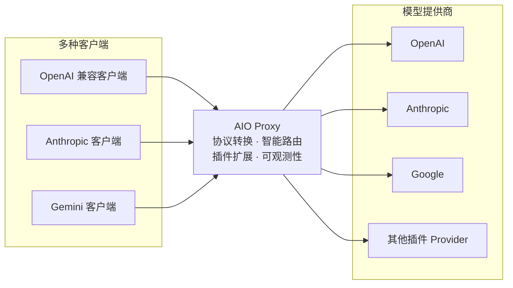

# AIO Proxy

[English](./README.md) | 简体中文

用一个 API 入口接入和管理多个模型提供商。AIO Proxy 提供可扩展的插件系统、自动路由与故障回退，以及覆盖用量、费用和请求链路的可观测性。



## 核心能力

- **插件化接入**：通过插件连接不同模型提供商，支持 AI SDK Provider 包和 OAuth 账号。
- **丰富可观测性**：集中查看请求量、Token 用量、费用和完整请求链路。
- **主流协议兼容**：支持 OpenAI Chat Completions、OpenAI Responses、Anthropic Messages 和 Gemini GenerateContent。
- **多 Provider 路由**：按模型、Provider priority 和 Provider weight 选择候选，支持模型别名、故障回退和会话亲和。
- **透明协议转换**：协议一致时原始透传，协议不一致时自动转换。

## 安装

### Homebrew

```bash
brew install aio-proxy/tap/aio-proxy
```

### Bun

```bash
bun add -g aio-proxy
```

## 快速开始

```bash
aio-proxy run --open
```

- API：`http://127.0.0.1:9317`
- Dashboard：`http://127.0.0.1:9317/dashboard`

首次运行会创建 `~/.aio-proxy/config.jsonc`。初始配置不包含 Provider，可以通过 Dashboard 添加，也可以直接编辑配置文件：

```bash
aio-proxy config path
aio-proxy config edit
```

## 配置

下面的示例将 `gpt-5` 路由到 OpenAI Responses API：

```jsonc
{
  "$schema": "https://cdn.jsdelivr.net/npm/aio-proxy@latest/config.schema.json",
  "providers": {
    "openai": {
      "kind": "api",
      "protocol": "openai-response",
      "baseURL": "https://api.openai.com/v1",
      "apiKey": "{{env.OPENAI_API_KEY}}",
      "models": ["gpt-5"],
    },
  },
}
```

验证或重新加载配置：

```bash
aio-proxy config validate
aio-proxy reload
```

支持 `$schema` 的编辑器可以为配置提供补全和校验。`{{env.NAME}}` 用于读取环境变量。

### 多协议端点

部分上游原生支持多种协议。可以用 `endpoints` 声明这些额外的端点；当请求的入站协议命中任意一个已声明的端点时，请求会被原样转发（原始透传），而不会经过协议转换：

```jsonc
{
  "providers": {
    // 一方渠道：按协议分别声明端点。保留原有的 protocol/baseURL 作为主端点，
    // 再追加其他协议。
    "moonshot": {
      "kind": "api",
      "protocol": "openai-compatible",
      "baseURL": "https://api.moonshot.cn/v1",
      "apiKey": "{{env.MOONSHOT_API_KEY}}",
      "models": ["kimi-k2"],
      "endpoints": [{ "protocol": "anthropic", "baseURL": "https://api.moonshot.cn/anthropic/v1", "auth": "bearer" }],
    },
    // 聚合网关：多个协议共用同一个 AI SDK 风格的 base URL。
    "gateway": {
      "kind": "api",
      "apiKey": "{{env.GATEWAY_KEY}}",
      "models": ["gpt-5"],
      "endpoints": { "baseURL": "https://gw.example.com/v1", "protocol": ["openai-response", "anthropic"] },
    },
  },
}
```

规则：

- `endpoints` 中每一项的 `baseURL` 就是传给对应 AI SDK 包的那个值：OpenAI 系和 Anthropic 端点包含 `/v1` 段，Gemini 端点包含 `/v1beta`（因此 Gemini 无法共用 `/v1` 的 base URL，需要在数组中单独声明一项）。
- 厂商文档给出的 Anthropic 地址通常是用于 `ANTHROPIC_BASE_URL` 的形式（例如 `https://api.z.ai/api/anthropic`）；填写到这里时需要补上 `/v1`。
- `auth` 仅支持用于 `anthropic` 端点（配置在其他协议的端点上会导致校验失败）：`bearer` 会发送 `Authorization: Bearer`，且要求该 Provider 声明 `apiKey`，默认的 `x-api-key` 维持现有请求头。
- 顶层的 `protocol`/`baseURL` 仍然是主端点，并保持既有的透传行为——透传时会丢弃其 base URL 的路径部分，只取 origin 并拼接入站请求的路径，因此单协议的 Provider 建议继续使用顶层的 `protocol`/`baseURL`；跨协议转换始终指向主端点。如果没有声明顶层的 `protocol`/`baseURL`，主端点就是 `endpoints` 中的第一项（共用形式下为其 `protocol` 列表中的第一个协议）。
- 在 Dashboard 中编辑声明了 `endpoints` 的 Provider 目前会丢失该字段；在 Dashboard 支持之前，请直接编辑配置文件。

## 路由规则

`providers` 对象中的键是稳定的 **Provider ID**。**Provider priority** 是整数故障回退层级（`0..10000`，默认 `0`）；数值越大越先尝试。**Provider weight** 在同一 priority 层级内分配流量：它是有限的配置数值，默认 `1`，经 `Math.round` 后钳制到 `0..10000`。现有配置会保留旧的 `weight` 值，但该字段不再表示全局固定顺序。

```yaml
providers:
  provider-a:
    priority: 0
    weight: 1000
router:
  models:
    model-m:
      providers:
        provider-a: { priority: 30, weight: 6000 }
        provider-b: { priority: 30, weight: 4000 }
        provider-c: { priority: 20 }
```

`router.models` 的键是精确的客户端请求模型 ID。它们不会创建候选、选择上游目标，也不使用 glob 匹配。缺少的 Provider 条目或字段继承 Provider 默认值。模型上的正数 weight 可以重新启用默认 weight 为零的 Provider。

一次请求按以下规则处理：

1. 先将完整请求模型字符串作为精确的 Provider-qualified 路由匹配。若匹配，直接选择该 Provider，并绕过 Provider priority 和 Provider weight（包括有效 weight 为零）。`enabled: false` 仍会拦截该 Provider，因为已禁用的 Provider 不在路由表中。
2. 否则将同一完整字符串作为精确的普通客户端模型 ID 匹配，包括包含 `/` 的字符串。
3. 将 Provider 默认值与该精确模型的稀疏 `providers` 覆盖合并。丢弃 `enabled: false` 或有效 weight 为零的普通候选。
4. 剩余候选按 Provider priority 从高到低，再在同一 priority 层级内按 Provider weight 排序。配置顺序是目录表示和诊断的确定性平局规则，不再是同一层级中正数 weight 候选的请求顺序。
5. 稳定（非 generated）逻辑会话使用确定性加权抽取，因此在路由快照未变时，token-count 与生成共用同一预先尝试顺序。generated 会话每次独立随机抽取。
6. 响应 owner，然后是会话亲和，可将合格的普通候选提前到队首。它们不会复活已禁用或 weight 为零的 Provider。会话亲和仍会覆盖 priority，使会话可以粘在此前成功的 Provider 上（例如 prompt-cache 连续性）。
7. 同协议的 `api` Provider 使用原始透传，其他组合通过 AI SDK 转换。
8. 当前 Provider 失败后尝试下一个候选；全部失败时返回最后一次失败。

在上述示例策略中，priority 30 时 `provider-a` 大约 60% 排在第一、`provider-b` 大约 40%。若选中的 Provider 失败，会先尝试同一 priority-30 的另一个 Provider，再尝试 `provider-c`。

若所有普通候选均已禁用或有效 weight 为零，该模型会从 `GET /v1/models` 中省略，普通请求沿用现有的模型不可用/未找到行为。仍启用的 Provider 可通过精确的 Provider-qualified 请求访问。

即使请求选择是加权的，`GET /v1/models` 也是确定性的。公开的代表 Provider 从已启用、有效 weight 为正的候选中选出，依次按最高 Provider priority、最高 Provider weight、原始配置顺序。

### 保留此前以 weight 作为顺序的行为

此前 Provider weight 是全局固定顺序：不同的 weight 从高到低尝试，相同或省略的 weight 保持配置顺序。在新约定下，这些 Provider 的默认 Provider priority 均为 `0`，Provider weight 是同一层级内的流量份额。现有文件不会被改写。

| 旧配置                             | 保留原意的新配置                                                                          |
| ---------------------------------- | ----------------------------------------------------------------------------------------- |
| 用互不相同的旧 weight 作为固定顺序 | 把旧 `weight` 复制到 `priority`；把新 `weight` 设为 `1`。                                 |
| 旧 weight 相同且配置顺序有意义     | 按旧配置顺序显式指定递减的 priority；把 `weight` 设为 `1`。                               |
| 省略旧 weight                      | 此前在 priority 为零时仍可参与；设置正数的新 weight，通常为 `1`。                         |
| 小数旧 weight                      | 按旧的从高到低顺序指定 priority；若仍作为流量比例保留，新 weight 会经 `Math.round` 取整。 |
| 负数或大于 10000 的旧 weight       | 指定范围内的显式 priority 以保留旧的总顺序；不要复制会在钳制后塌缩的值。                  |
| 旧 `weight: 0`                     | 此前仍是合格的回退候选；把新 `weight` 设为 `1`，并设置预期的 priority。                   |
| `enabled: false`                   | 无变化；仍是硬禁用。                                                                      |

## API

| 协议或用途               | 方法与路径                                          |
| ------------------------ | --------------------------------------------------- |
| 健康检查                 | `GET /health`                                       |
| 模型列表                 | `GET /v1/models`                                    |
| OpenAI Chat Completions  | `POST /v1/chat/completions`                         |
| OpenAI Responses         | `POST /v1/responses`                                |
| OpenAI Completions       | `POST /v1/completions`                              |
| OpenAI Responses compact | `POST /v1/responses/compact`                        |
| Anthropic Messages       | `POST /v1/messages`                                 |
| Anthropic Token Counting | `POST /v1/messages/count_tokens`                    |
| Gemini                   | `POST /v1beta/models/{model}:generateContent`       |
| Gemini 流式生成          | `POST /v1beta/models/{model}:streamGenerateContent` |
| Gemini Token Counting    | `POST /v1beta/models/{model}:countTokens`           |

其余官方 Responses 资源操作（`GET /v1/responses/:id`、`DELETE /v1/responses/:id`、`POST /v1/responses/:id/cancel`、`GET /v1/responses/:id/input_items`）返回协议形 501。

调用 OpenAI Responses 入口：

```bash
curl http://127.0.0.1:9317/v1/responses \
  -H 'Content-Type: application/json' \
  -d '{"model":"gpt-5","input":"用一句话介绍 AIO Proxy。"}'
```

## Dashboard 与可观测性

Dashboard 默认位于 `http://127.0.0.1:9317/dashboard`，用于管理 Provider 并提供运行可观测性：

- 添加、编辑和测试 Provider，包括插件 OAuth 登录。
- 查看请求量、Token 用量和费用趋势。
- 搜索完整请求链路，检查每次 Provider 尝试的状态与耗时。

可以通过 `server.password` 设置 Dashboard 密码。该密码只保护 Dashboard，不保护模型 API。

## 网络与安全

顶层 `proxy` 可以配置默认 HTTP(S) 代理；Provider 可以继承、覆盖或通过 `false` 禁用它。`api` Provider 还可以通过 `headers` 设置上游请求头。

AIO Proxy 进程目前只允许绑定到 `127.0.0.1`、`::1` 或 `localhost`，但可以运行在个人电脑、远程服务器或容器中。需要远程访问时，可以通过反向代理、隧道或网关暴露服务，并在外层配置 TLS、身份认证和访问控制。

## 常用命令

```bash
aio-proxy status --deep
aio-proxy provider list --probe
aio-proxy doctor
aio-proxy --help
```

## 贡献

开发环境和提交流程请参阅 [CONTRIBUTING.md](./CONTRIBUTING.md)。

## 许可证

[MIT](./LICENSE)
