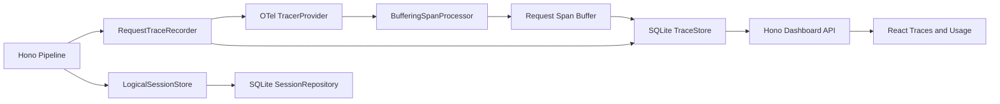

# Trace and Session Affinity Design

**Date:** 2026-07-24
**Status:** Approved

## Context

aio-proxy currently persists terminal request metadata in `request_log` and usage in a separate `usage` table. The Dashboard joins both tables for request history and usage aggregation. This records the final outcome but cannot represent request parsing, session resolution, routing, Provider fallback, streaming, or response conversion as a trace.

The replacement must keep Hono and SQLite as the deployed server, make Trace an internal capability rather than a new architectural center, avoid maintaining independent request-log and Trace facts, and add Provider affinity for logical sessions.

## Goals

- Make one inbound model request one bounded local Trace.
- Replace per-request `request_log + usage` storage with one Trace fact model.
- Record the full pipeline, including overlapping streaming phases.
- Preserve current Dashboard usage behavior and begin accumulating permanent daily model usage.
- Persist session response chains and `(session, requested model) → Provider ID` affinity.
- Use OpenTelemetry Span, context, ID, status, attribute, event, and link semantics.
- Keep Hono request availability independent of observability persistence failures.

## Non-goals

- No Collector, OTLP export, external Trace backend, or external service dependency.
- No upstream `traceparent` injection and no Trace ID response header.
- No request or response body persistence in Trace storage.
- No Dashboard query API for LogTape JSONL files.
- No affinity administration UI in the first version.
- No historical `request_log` or `usage` migration.
- No reusable third-party React Trace Viewer dependency.

## Architecture



### RequestTraceRecorder

A request-scoped recorder starts the root Span, registers the request buffer, closes the pipeline spans after the response stream truly terminates, and commits the completed Trace.

### OpenTelemetry runtime

`@opentelemetry/api`, `@opentelemetry/sdk-trace-node`, and `@opentelemetry/semantic-conventions` own standard Span lifecycle, async context, trace/span IDs, status, Links, and standard attribute names.

A custom `BufferingSpanProcessor` collects ended Spans into the registered request buffer. It does not write SQLite and does not export OTLP.

### TraceStore

The SQLite store:

- inserts the minimal root row at request start;
- commits the complete Trace and summaries in one terminal transaction;
- lists root Spans and loads a full Trace;
- calculates short-range usage;
- recovers abandoned running roots;
- prunes raw Trace data after 45 days.

### LogicalSessionStore

Protocol adapters continue extracting session signals. The store delegates response-chain and affinity state to SQLite. It remains separate from TraceStore so tracing does not own routing semantics.

The existing model-first router remains unchanged. After candidate resolution, the pipeline may move one eligible sticky Provider ID to the front; every remaining candidate keeps descending Provider weight and configuration order.

## Span Model

Raw passthrough and AI SDK paths use stable semantic names. Implementation differences live in attributes such as transport, source protocol, target protocol, preparation mode, and egress mode.

```text
aio_proxy.request                         SERVER
├── aio_proxy.request.parse               INTERNAL
├── aio_proxy.session.resolve             INTERNAL
├── aio_proxy.route.resolve               INTERNAL
├── aio_proxy.provider.attempt            INTERNAL
│   ├── aio_proxy.request.prepare         INTERNAL
│   ├── gen_ai.client.inference           CLIENT
│   ├── aio_proxy.response.egress         INTERNAL
│   └── aio_proxy.usage.resolve           INTERNAL
└── aio_proxy.provider.attempt            INTERNAL
    └── ...
```

`gen_ai.client.inference` and `aio_proxy.response.egress` may overlap because upstream generation and downstream protocol encoding happen concurrently. The Provider attempt and root Span end only after completion, error, or client cancellation.

The inference and egress spans record separate first-upstream-response and first-client-response events. This permits Provider latency and proxy processing latency to be distinguished.

Use OpenTelemetry semantic attributes where a standard exists. Routing, affinity, Provider weight, transport, and protocol conversion use `aio_proxy.*`. An attribute is stored once: frequently queried values use typed columns; only long-tail values use JSON. API responses assemble the complete attribute view without duplicating typed values in JSON.

Detailed errors and bounded wire snapshots remain LogTape-only. Trace rows keep error type, error code, HTTP status, and correlation identifiers. LogTape context gains `traceId` and the current `spanId` while retaining `requestId`, attempt index, Provider ID, and model ID.

## SQLite Schema

### `trace_span`

All root and child Spans share one table.

| Group | Columns |
| --- | --- |
| Identity | `trace_id`, `span_id`, nullable `parent_span_id`, `name`, `kind` |
| Lifecycle | `started_at`, nullable `ended_at`, `status_code` |
| Termination | nullable `termination_reason`, `error_type`, `error_code` |
| Root summary | `request_id`, raw `session_source/session_id`, inbound protocol, requested model, final Provider ID/model/HTTP status |
| Usage summary | input/output/total/cache/reasoning tokens, price model, estimated cost |
| Attempt | attempt index, Provider ID/kind, model, transport, source/target protocol, selection reason |
| Long tail | `attributes_json`, `events_json`, `links_json` |

Constraints and indexes:

- composite primary key `(trace_id, span_id)`;
- one root (`parent_span_id IS NULL`) per Trace;
- unique root `request_id`;
- self-reference parents within the same Trace;
- root indexes for start time, status, final Provider ID, model, and protocol;
- root index on `(session_source, session_id, requested_model_id, started_at)`;
- `(trace_id, started_at)` for detail ordering;
- no arbitrary JSON attribute indexes.

Root summary values are a controlled projection of the same Trace, committed atomically with children. They intentionally avoid self-joins in request lists and usage aggregation; they are not an independent log subsystem.

### `session_affinity`

```text
PRIMARY KEY (session_source, session_id, requested_model_id)
provider_id, revision, expires_at, updated_at
```

Session IDs are stored as their trimmed raw values, limited to 512 characters, with the source namespace kept separately. Successful use slides expiry by one hour. Revision implements optimistic compare-and-swap.

### `session_response`

```text
PRIMARY KEY (sha256(response_id))
session_source, session_id, expires_at
```

Successful Responses requests map their response ID to the resolved session. The original response ID is not stored. Reads slide expiry by one hour, allowing `previous_response_id` continuity across restart.

### `usage_daily`

```text
PRIMARY KEY (local_day, model_dimension)
request_count
success_count
error_count
cancelled_count
interrupted_count
usage_request_count
priced_request_count
input_tokens
output_tokens
cache_read_tokens
cache_write_tokens
reasoning_tokens
estimated_cost_usd
```

`model_dimension` is `finalModelId ?? requestedModelId`. The bucket day is the request completion date in the server's local timezone. Rows are retained permanently and grow by day/model combinations rather than request count. The first version writes this table but does not add the future 12-month UI.

`usage_daily` deliberately has no Provider ID column or Provider dimension. Provider-level analysis reads retained root Spans and is limited by the 45-day raw Trace retention window.

## Request Lifecycle

1. Generate `requestId`, start the OTel root Span, register its buffer, and synchronously insert the minimal running root.
2. Record parse, session resolution, and route resolution spans.
3. Resolve session identity using the current signal precedence, including explicit session/conversation values, Claude Code identity, `previous_response_id`, and `prompt_cache_key`. Do not add message-content or request-ID inference.
4. Look up affinity by `(session source, raw session ID, requested model)`.
5. Resolve candidates model-first. If the bound Provider ID is still eligible, move it to the first position once.
6. Record prepare, inference, egress, and usage spans for every Provider attempt. Fallback preserves the remaining Provider weight order.
7. Return the response without waiting for the complete stream. The recorder observes actual completion, cancellation, or failure.
8. End the root Span and synchronously run one terminal SQLite transaction.

The terminal transaction:

- inserts all buffered child Spans in parent-first order;
- transitions the root from running to terminal and writes its summary and usage;
- idempotently increments `usage_daily` only on the first terminal transition;
- commits a successful response-chain mapping;
- refreshes or rebinds affinity using optimistic CAS.

If the initial root insert failed, the terminal transaction attempts a complete root insert instead.

## Status and Recovery

Only OpenTelemetry status codes are stored. Additional termination reason explains errors:

| State | Representation |
| --- | --- |
| Running | `ended_at IS NULL`, `UNSET` |
| Success | ended, `UNSET`, no termination reason |
| Failure | ended, `ERROR`, `failure` |
| Client cancellation | ended, `ERROR`, `cancelled` |
| Process interruption | ended, `ERROR`, `interrupted` |

`OK` remains valid but automatic instrumentation does not set it.

One aio-proxy home supports one active Hono service. Startup atomically marks every abandoned running root as interrupted and increments the completion-day `usage_daily` bucket. Missing pipeline children are not fabricated.

Trace persistence is fail-open. A start or terminal write failure emits a structured LogTape error and never changes the client response. Affinity persistence failure means the successful request does not establish or refresh stickiness.

## Affinity Concurrency

- Missing or expired binding: the first successful request wins creation.
- Sticky Provider success: refresh TTL only if the observed revision still matches.
- Sticky Provider failure followed by fallback success: replace Provider ID only if the observed revision still matches.
- CAS loss: another request won; do not retry or overwrite it.
- Disabled, removed, or model-ineligible binding: ignore it for this request and rebind only after another Provider succeeds.

No per-session request serialization or global lock is introduced.

## Trace Context

A valid incoming W3C `traceparent` becomes an OTel Link on a newly generated local root. aio-proxy does not continue the external trace ID, preserving the one-request-per-local-Trace boundary. The first version neither injects local `traceparent` upstream nor exposes local Trace ID to clients.

## Dashboard and API

```text
GET /dashboard/api/traces
GET /dashboard/api/traces/:traceId
GET /dashboard/api/usage
```

`/traces` lists only root Spans with server pagination and filters for time, OTel status, termination reason, trace/request/session identity, protocol, model, final Provider ID, and HTTP status. Trace list time ranges use start time so running requests are visible.

`/traces/:traceId` returns the root summary and every Span ordered by start time. Running traces may contain only the persisted root until terminal commit. Detail refresh is manual.

The existing `/usage` response contract remains stable. Short-range usage uses completed root Spans. Future annual daily/model views query `usage_daily`.

The old `/logs` page and `/dashboard/api/logs` endpoint are removed without redirects or a compatibility DTO.

The Dashboard menu uses `Traces`. `/traces/:traceId` is a dedicated full-width route with a Span tree, duration bars, and a selected-Span attribute/event/link panel. Clicking a session ID navigates back to `/traces` with source and ID filters. Existing React, TanStack Query/Table, Tailwind, and shadcn components are sufficient.

## Performance

With Bun SQLite WAL and `synchronous=NORMAL`, a synthetic 10-child-Span request measured:

- root-start transaction: p50 0.021 ms, p95 0.043 ms, p99 0.119 ms;
- terminal transaction: p50 0.064 ms, p95 0.103 ms, p99 0.159 ms;
- combined sequential throughput approximately 6.1k requests/s on the development machine.

The benchmark is directional, not a CI threshold. Implementation must rerun it with the final schema. No asynchronous writer, worker, micro-batch queue, or shutdown flush protocol is introduced unless real measurements show synchronous transactions are inadequate.

## Migration

The schema migration creates `trace_span`, `session_affinity`, `session_response`, and `usage_daily`, then drops `request_log` and `usage`. Existing request and usage history is deliberately discarded.

## Verification

- DB behavior: running root insertion, terminal atomicity, controlled root projection, idempotent daily aggregation, retention, and startup recovery.
- Session behavior: signal precedence, persisted response chain, sliding TTL, concurrent first binding, CAS refresh/rebind, and invalid Provider fallback.
- Pipeline behavior: raw and AI SDK Span trees, overlapping stream stages, both first-response events, fallback, cancellation, parsing failure, and actual stream termination.
- Failure behavior: start and terminal persistence remain fail-open and emit correlated LogTape fields.
- API behavior: pagination, indexed filters, detail 404, running detail, and unchanged usage results.
- Dashboard behavior: list-to-detail routing, manual detail refresh, session filtering, Span selection, and duration-bar calculations.
- Run `bun run preflight` and rerun the SQLite benchmark with the final schema before completion.

## Deferred Work

- Optional OTLP export and controlled upstream propagation.
- A 12-month GitHub-style daily Token view and model trend UI backed by `usage_daily`.
- Dashboard LogTape retrieval or external log-backend deep links.
- Affinity inspection and manual clear controls.
