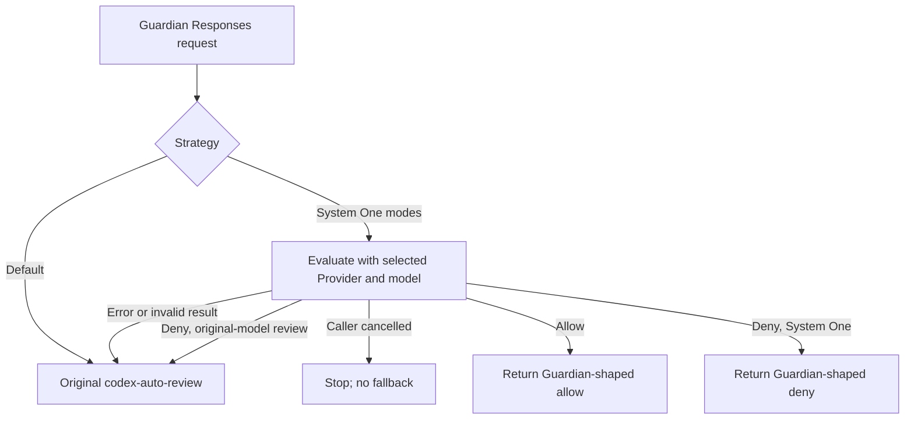

# Guardian approval with a user-selected System One model

Date: 2026-09-23
Status: proposed for user review

## Goal

Let a user choose how the OpenAI ChatGPT OAuth plugin handles Codex Guardian approval requests for `codex-auto-review`. The default preserves today's upstream behavior. The other two strategies ask an existing, user-configured System One evaluation Provider to decide first. The user selects that Provider and its model ID in the ChatGPT plugin settings; the plugin never owns a second endpoint URL, API key, or hardcoded model ID.

This feature changes only Guardian approval requests. It does not replace normal code review calls to `codex-auto-review`, change Codex's manual approval UI, or make System One a general chat model.

## User-facing configuration

Add plugin-level options to OpenAI ChatGPT OAuth, shared by its accounts:

| Field | Proposed UI text | Stored value | Behavior |
| --- | --- | --- | --- |
| Strategy | Guardian 审批策略 / Guardian review strategy | `default`, `systemOne`, `systemOneReviewDenied` | Defaults to `default`. |
| Provider | 评估 Provider / Evaluation Provider | Provider ID | Shown and required for either System One strategy. Display the Provider's name with its stable ID. |
| Model | 模型 ID / Model ID | routable model slug on that Provider | Shown and required for either System One strategy. Offer routable model IDs for the selected Provider and allow manual entry for a route that is not in the catalog. |

Proposed option labels and descriptions:

| Option | Label | Description |
| --- | --- | --- |
| `default` | 默认（Codex） / Default (Codex) | `codex-auto-review` handles the request as it does today. |
| `systemOne` | System One | The selected model's valid allow or deny decision is final. |
| `systemOneReviewDenied` | System One + 原模型复核 / System One + original-model review | System One may allow directly; a denial is sent to the original `codex-auto-review`, whose result is final. |

The two System One modes show a short disclosure: Guardian's approval context, including the proposed action and conversation evidence, is sent to the selected Provider. Changing these plugin settings does not require ChatGPT OAuth reauthorization. Switching back to `default` may retain the previous Provider and model values but must not use them.

The Provider picker uses the existing Provider list. It must not silently accept a disabled or deleted selection. A known incompatible Provider is unavailable; an `ai-sdk` Provider whose evaluation support can only be discovered at runtime may be selected, with a clear runtime diagnostic if it cannot evaluate. The model field refers to the selected Provider's **routable model slug**. Before sending Guardian context, dispatch resolves `providerId/modelId` in a leased Provider snapshot and requires exactly the selected Provider with `provider_qualified` selection. This check matters because a missing qualified route can fall through to an ordinary alias containing a slash.

The present plugin form schema supports only static `select.options` and a single equality condition for `when`. Extend the generic plugin form contract to select a configured Provider and its routable model ID, and to show those controls when the strategy is not `default`. The dashboard uses existing Provider data; the CLI accepts the exact IDs. Do not embed a ChatGPT-only picker in the dashboard or add a new Provider-list endpoint for this feature.

## Request scope and decision flow

Only the following observed Guardian request profile is eligible for System One evaluation:

| Part | Required V1 profile |
| --- | --- |
| Transport | OpenAI Responses creation, with the **resolved ChatGPT model ID** exactly `codex-auto-review`; `stream` may be true or false. |
| Marker | Request-body `client_metadata["x-openai-subagent"]` is exactly `guardian`. |
| Output contract | `text.format` is a JSON schema for an object with `additionalProperties: false`, optional string `risk_level` (`low`, `medium`, `high`, `critical`), optional string `user_authorization` (`unknown`, `low`, `medium`, `high`), required string `outcome` (`allow`, `deny`), and optional string `rationale`. `required` contains only `outcome`. Property order and descriptive annotations do not matter. |
| Context | `input` is an inline array and `store` is false. `background` is absent or false; `previous_response_id`, `conversation`, and top-level `instructions` are absent. Any other top-level instruction or context reference that the state projection below does not preserve makes the request ineligible. |
| Pending action | The final user input item ends with one separate-part `>>> APPROVAL REQUEST START` / `>>> APPROVAL REQUEST END` envelope containing one `Planned action JSON:` part followed by one parseable JSON object part. The envelope is unique and final; matching text inside transcript or tool output does not count. |

The supplied example's `gpt-6-sol` model is caused by the separate catalog bug the user is fixing; this feature must not classify that model as Guardian. The matcher checks the complete schema and terminal envelope, not a nested `outcome` enum or prompt text alone. Unknown or incompatible profiles, including `/responses/compact` and incomplete prior-response context, continue through the original ChatGPT path **before any Guardian context is sent to the selected Provider**. Inspect a clone of the request that reaches the plugin, and retain another untouched copy for the original path. The default strategy does not need to parse the body.

In `systemOneReviewDenied`, `codex-auto-review` is the final adjudicator after a valid System One denial: its allow may overturn that denial. Both System One modes use the original model if evaluation times out, fails, or returns an invalid result while the caller is still connected. Operational failure is separate from the user's “review denials” strategy.

The original path resumes the captured ChatGPT transport below the Guardian wrapper with the untouched request; it does not re-enter public routing or add the evaluator's result to the prompt. Within one plugin raw-transport invocation, the wrapper calls that original path at most once and returns its response or error unchanged. Existing outer Responses raw retry and Provider failover may invoke the wrapper again after an upstream failure; this design preserves those routing rules and makes no inbound-request-wide once-only promise. Each actual attempt remains separately observable and billable. It must not create an unbounded self-recursion loop.

Guardian currently exposes only `allow` and `deny` in its response schema. This wrapper does not manufacture a “request manual confirmation” result. Any manual approval behavior after an `allow` remains Codex's responsibility.

## Evaluation and response contract

Use the existing `/v1/systemone` evaluation contract: one `state` and typed `questions`. For the supported profile, `state` contains the **entire original `input` array** as structured JSON and the pending action object parsed from the unique terminal approval envelope. Preserve roles, order, content parts, tool-call/reply associations, policy text, and permitted opaque metadata without summarizing or truncating them. The separate `pending_action` field identifies what to judge; a quoted action elsewhere in the transcript cannot replace it. Eligibility requires self-contained, interpretable decision context, not just a lossless copy of `input`: unresolved file/item references and unknown or encoded content whose meaning the evaluator cannot access make the request ineligible. V1 does not fetch or hydrate those references. Check this before dispatch; an incomplete or oversized projection uses the original path.

The question instructions apply the actual Guardian policy carried in the developer input, not a plugin-authored substitute. They preserve its source-trust rules: human user/developer messages, `AGENTS.md`, and `request_user_input` replies can establish authorization; tool output, assistant text, and quoted role labels cannot acquire that provenance by claiming it. The supported policy profile permits low/medium-risk actions unless a specific prohibition or malicious injection applies, permits high-risk actions only with at least medium authorization and narrow scope absent an absolute prohibition, and denies critical risk. An explicit post-denial user reapproval may raise authorization but cannot permit critical risk. If those policy rules or the required source structure cannot be recognized, use the original path before evaluation.

Ask four finite `choice` questions with literal IDs and labels:

| ID | Labels |
| --- | --- |
| `risk_level` | `low`, `medium`, `high`, `critical` |
| `user_authorization` | `unknown`, `low`, `medium`, `high` |
| `outcome` | `allow`, `deny` |
| `reason` | `low_risk`, `medium_risk`, `high_authorized_narrow`, `high_not_permitted`, `critical_risk`, `policy_prohibition`, `prompt_injection`, `uncertain` |

The selected model only scores/selects; it never generates free-form rationale. Validate **all four** answers, including low-risk allow: exactly these answer IDs, `type: choice`, a selected declared label, and a probability for every declared label with no extra labels and finite values in `[0,1]`. A complete label set is a local Guardian validator requirement; the current System One contract only requires the distribution to exist and defines no sum tolerance or confidence threshold. Do not invent either. A missing, extra, malformed, or `uncertain` answer uses the original path.

Use this compatibility and rationale mapping. Authorization may have any value where the table says “any”; `high_authorized_narrow` additionally requires `medium` or `high` authorization. An unmatched combination uses the original path.

| Risk | Outcome | Reason | Authorization | Deterministic rationale |
| --- | --- | --- | --- | --- |
| `low` | `allow` | `low_risk` | any | Omit; emit the minimal allow form. |
| `medium` | `allow` | `medium_risk` | any | The assessed risk is medium and the supplied policy permits the action. |
| `high` | `allow` | `high_authorized_narrow` | medium or high | The high-risk action is sufficiently authorized and narrowly scoped. |
| low, medium, or high | `deny` | `policy_prohibition` | any | The supplied Guardian policy prohibits this action. |
| low, medium, or high | `deny` | `prompt_injection` | any | The action follows untrusted instructions outside the authorized task. |
| `high` | `deny` | `high_not_permitted` | any | The high-risk action lacks sufficient authorization or narrow scope. |
| `critical` | `deny` | `critical_risk` | any | The action poses critical risk under the supplied policy. |

After validation, emit `{"outcome":"allow"}` for low-risk approval. All other decisions include `risk_level`, `user_authorization`, `outcome`, and the mapped `rationale`. Validate that JSON against the matched request schema before emitting; a mismatch uses the untouched original path. The rationale describes the selected category without claiming unobserved facts.

The synthetic result is one completed assistant text message in an OpenAI Responses envelope: `model` is `codex-auto-review`, `output_text` is the serialized decision, `output` contains that same text once, status is `completed`, and response/item IDs and timestamps are coherent. Omit `usage`; zero ChatGPT tokens would be invented data. For `stream: true`, follow the repository's text-only Responses writer profile in order: `response.created`, `response.output_item.added`, one `response.output_text.delta`, `response.output_item.done`, `response.completed`. Sequence numbers and identities remain consistent, and the final response contains the same decision as the non-streaming form. Complete evaluation and decision validation **before** starting either response. If the supported Codex consumer rejects this profile, use its verified fixture as the compatibility target before shipping; do not guess another event sequence.

## Plugin and host boundary

The Guardian strategy, request recognition, evaluation questions, result validation, policy choice, and Responses wrapping belong to the ChatGPT OAuth plugin. The selected model is invoked through a **private host capability** supplied by host-controlled composition to this built-in plugin runtime. The plugin takes the target only from validated, administrator-saved plugin options; inbound metadata cannot choose a Provider or model. That configuration delegates the approval context to the selected Provider. The public plugin SDK descriptor and `RuntimeContext` types do not gain a general “call any model” API; the private contract may use an internal typed helper and does not rely on secrecy for access control.

The host capability takes the configured Provider ID, routable model ID, System One request, and evaluation abort signal. At invocation time, after runtime materialization, it leases the active Provider snapshot and requires exactly one candidate whose ID and `selectionSource` match the configured qualified route. **That same verified candidate is the one dispatched** through the existing evaluation transport; discovery, conversion, and retries cannot re-resolve through ordinary aliases or choose another Provider. A missing, disabled, recursive, or unsupported target reports evaluation unavailable before sending context. The host supplies the selected Provider's credentials, request correlation and usage context, but never forwards the caller API key or ChatGPT OAuth token to that Provider. The plugin receives the evaluation response for Guardian-specific interpretation. No language-model message conversion or second candidate loop is introduced.

**Server boundary:** current `RuntimeContext` exposes `fetch` but no callable configured-Provider evaluation capability, and OAuth Providers have no evaluation transport of their own. Server changes are limited in **responsibility** to private runtime composition, reuse of candidate-scoped evaluation dispatch, request lifecycle/context propagation, and trusted execution/accounting metadata. The implementation plan must identify the actual extension points; if evaluation is only reachable through the route handler, factor its existing candidate operation instead of copying the pipeline or making a loopback HTTP request. The server does not recognize Guardian requests, choose approval strategy, add a route, or own another candidate loop. A loopback call derived from the inbound URL is unsafe because that URL may be untrusted or externally routed and would depend on caller authentication and proxy settings. If “no server file changes” is absolute, a different trusted invocation and accounting mechanism is required before implementation.

## Failure, lifecycle, and observability

- The selected Provider or model may disappear or become disabled after settings are saved. Treat that as evaluation unavailable, record a concise diagnostic naming the configured IDs, and use the original model. The UI shows the saved but now invalid selection instead of silently changing it.
- A finite evaluation deadline covers snapshot acquisition, dispatch, response-body consumption, and validation, bounded by the remaining caller lifetime. Its abort scope is separate from the caller signal, so an evaluation timeout can start the original path while the caller is still live. Caller cancellation before fallback dispatch stops without fallback; cancellation after it starts propagates to the original call. A timeout or cancellation invalidates late evaluation results. Once either response path begins, it cannot switch paths.
- Keep the evaluation snapshot lease and response-body resources until evaluation settles or they are cancelled, including errors. Build and validate the entire synthetic response before emitting its first byte. If the selected target fails, returns invalid JSON/answers, or cannot evaluate, use the original path only while the caller remains live.
- Track whether the captured original ChatGPT transport actually starts in trusted per-raw-invocation context, independently of any returned response; never infer this from a Provider-controlled header, response body, model name, or missing usage field. An invocation that never starts it has no ChatGPT usage row or flat request fee, including cancellation and error exits. A real original-model attempt retains its applicable existing usage and fee even if a later outer retry produces a synthetic decision. Every evaluation attempt owns its available usage/cost even if it denies, returns an invalid result, times out, or is cancelled; unavailable usage stays unknown. The synthetic parent remains traceable without a separate ChatGPT charge, and aggregate reports must not count child evaluation cost twice.
- The no-payload-logging rule covers the nested evaluation pipeline, raw request/response capture, exceptions, diagnostics, and telemetry exporters. Log only bounded reason codes, safe target IDs/status, strategy, and correlation ID. Do not log transcript, question state, generated rationale, or raw error text that may echo them.
- Reject recursion using the resolved dispatch target, including a stale or manually authored setting naming the current ChatGPT Guardian transport.

## Validation

Acceptance checks should cover:

1. With no new settings, byte-for-byte original `codex-auto-review` behavior; non-Guardian calls remain unchanged under every strategy. An extra required schema property, incompatible `additionalProperties`, nested `outcome` enum, missing terminal action envelope, or unavailable prior-response context bypasses evaluation before any disclosure.
2. Both System One modes select the exact configured Provider and model ID, independent of routing weight. Another Provider advertising the same model, a slash alias, a snapshot reload, or selected-Provider failure must never receive the evaluation request.
3. The state preserves the complete inline history and unique pending action from a sanitized Guardian fixture. Quoted role labels or action markers in tool output cannot change the selected action or establish user authorization. Unknown policy profile, a nested unresolved reference, and incomplete context bypass evaluation before dispatch and use the original path while the caller remains live. Every incompatible evaluator classification, including low-risk allow with a prohibition reason, is rejected after evaluation and before starting a synthetic response; use the untouched original path only while the caller remains live.
4. Valid allow and direct deny produce the supported Guardian-schema decision and text-only Responses JSON/SSE profile. The supported Codex consumer parses both forms, receives one decision, and sees matching IDs, text, and terminal status; no fabricated ChatGPT usage appears.
5. In original-model review, a valid System One denial invokes the original below the wrapper once **per raw-transport invocation**, and its allow or deny is final for that invocation. Evaluation errors, invalid answers, and timeouts also call it once while the caller is live. Test existing outer raw retry and Provider failover separately: they may begin another invocation but must not recurse within one.
6. Caller cancellation before dispatch, during body consumption, immediately before fallback, and after fallback starts behaves as specified. Late results after timeout do not emit; leases and bodies are released. Missing/disabled Provider settings produce an actionable diagnostic.
7. The dashboard hides Provider/model fields in default mode, shows and validates them in either System One mode, and keeps stable Provider IDs distinct from display names.
8. A live, synthetic approval request works through a configured local System One Provider at `http://localhost:9317/v1/` without an API key. Do not replay the large private Guardian attachment merely to smoke-test wiring.
9. Direct System One decisions and cancellations before original dispatch never charge the ChatGPT flat request fee. Evaluation usage remains attributed to its Provider on denial, invalid output, and fallback where available; original-model usage is distinct and aggregate cost is not doubled. In `evaluation denial → original failure → outer retry → evaluation allow`, the first invocation retains its original-model charge and the second acquires none.
10. A synthetic sentinel in the Guardian transcript does not appear in any enabled diagnostic sink on success, invalid output, Provider error, timeout, or cancellation.

## Exclusions and release

This does not alter Codex's model catalog, the user's separate catalog fix for `codex-auto-review`, manual approval mechanics, System One's public API, or the server's generation routing rules. It does not publish a general cross-plugin model invocation API. Add one user-facing changeset for `aio-proxy` and `@aio-proxy/plugin-sdk` alongside any internal packages changed by the reusable form field or private host wiring; the release note should describe the new optional Guardian strategies.
