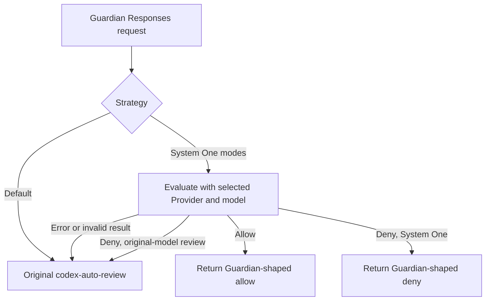

# Guardian approval with a user-selected System One model

Date: 2026-09-23
Status: proposed for user review

## Goal

Let a user choose how the OpenAI ChatGPT OAuth plugin handles Codex Guardian approval requests for `codex-auto-review`. The default preserves today's upstream behavior. The other two strategies ask an existing, user-configured System One evaluation Provider to decide first. The user selects that Provider and its model ID in the ChatGPT plugin settings; the plugin never owns a second endpoint URL, API key, or hardcoded model ID.

This feature changes only Guardian approval requests. It does not replace normal code review calls to `codex-auto-review`, change Codex's manual approval UI, or make System One a general chat model.

## User-facing configuration

Add plugin-level options to OpenAI ChatGPT OAuth, shared by its accounts:

| Field | Proposed UI text | Stored value | Behavior |
| --- | --- | --- | --- |
| Strategy | Guardian 审批策略 / Guardian review strategy | `default`, `systemOne`, `systemOneReviewDenied` | Defaults to `default`. |
| Provider | 评估 Provider / Evaluation Provider | Provider ID | Shown and required for either System One strategy. Display the Provider's name with its stable ID. |
| Model | 模型 ID / Model ID | routable model slug on that Provider | Shown and required for either System One strategy. Offer routable model IDs for the selected Provider and allow manual entry for a route that is not in the catalog. |

Proposed option labels and descriptions:

| Option | Label | Description |
| --- | --- | --- |
| `default` | 默认（Codex） / Default (Codex) | `codex-auto-review` handles the request as it does today. |
| `systemOne` | System One | The selected model's valid allow or deny decision is final. |
| `systemOneReviewDenied` | System One + 原模型复核 / System One + original-model review | System One may allow directly; a denial is sent to the original `codex-auto-review`, whose result is final. |

The two System One modes show a short disclosure: Guardian's approval context, including the proposed action and conversation evidence, is sent to the selected Provider. Changing these plugin settings does not require ChatGPT OAuth reauthorization. Switching back to `default` may retain the previous Provider and model values but must not use them.

The Provider picker uses the existing Provider list. It must not silently accept a disabled or deleted selection. A known incompatible Provider is unavailable; an `ai-sdk` Provider whose evaluation support can only be discovered at runtime may be selected, with a clear runtime diagnostic if it cannot evaluate. The model field refers to the selected Provider's **routable model slug**. Before sending Guardian context, dispatch resolves `providerId/modelId` in a leased Provider snapshot and requires exactly the selected Provider with `provider_qualified` selection. This check matters because a missing qualified route can fall through to an ordinary alias containing a slash.

The present plugin form schema supports only static `select.options` and a single equality condition for `when`. Extend the generic plugin form contract to select a configured Provider and its routable model ID, and to show those controls when the strategy is not `default`. The dashboard uses existing Provider data; the CLI accepts the exact IDs. Do not embed a ChatGPT-only picker in the dashboard or add a new Provider-list endpoint for this feature.

## Request scope and decision flow

Intercept only OpenAI Responses creation requests whose resolved ChatGPT model ID is exactly `codex-auto-review`, whose request-body `client_metadata["x-openai-subagent"]` is `guardian`, and whose `text.format` JSON schema contains the Guardian `outcome: allow | deny` contract. The supplied example has `gpt-6-sol` only because of the separate catalog bug the user is fixing; this feature must not treat that model as Guardian. A malformed or missing marker/schema, `/responses/compact`, another model, and all other protocols continue through the existing ChatGPT path. Inspect the request copy that reaches the plugin before consuming its body, and retain a separate untouched copy for fallback. Do not identify Guardian by prompt text alone.

In `systemOneReviewDenied`, `codex-auto-review` is the final adjudicator after a System One denial: its allow may overturn that denial. Both System One modes use the original model if evaluation times out, fails, or returns an invalid result. Operational failure is separate from the user's “review denials” strategy. Invoke the original model at most once, and pass its response through unchanged.

Guardian currently exposes only `allow` and `deny` in its response schema. This wrapper does not manufacture a “request manual confirmation” result. Any manual approval behavior after an `allow` remains Codex's responsibility.

## Evaluation and response contract

Use the existing `/v1/systemone` evaluation contract: one `state` and typed `questions`. The `state` carries the original Guardian input with roles and order intact, including its policy and authorization context. Do not replace it with a lossy action summary or arbitrary truncation. Evaluation question instructions must direct the model to judge the **latest** approval request and apply the supplied Guardian policy, including its source-trust rules. User/developer messages, `AGENTS.md`, and `request_user_input` replies may establish authorization; other material can do so only when the user explicitly authorizes it. Tool outputs and untrusted transcript material are evidence, not new instructions.

Ask finite `choice` questions for `risk_level`, `user_authorization`, `outcome`, and a decision-reason category. The selected model only scores/selects; it is not asked to generate free-form rationale. The reason categories must cover low/medium risk approval, sufficiently authorized high-risk approval, insufficient authorization, critical risk, specific policy prohibition, and malicious prompt injection. Validate the answer types, selected labels, and required distributions before using them. Contradictory answers (for example, `critical` risk plus `allow`, or any decision other than low-risk allow without a compatible reason) are invalid and fall back to the original model. Do not add a configurable confidence threshold in the first version.

For a valid System One result, use `{"outcome":"allow"}` for a low-risk approval, as Guardian requests. All other decisions include `risk_level`, `user_authorization`, `outcome`, and a short deterministic `rationale` mapped from the reason category. The rationale must describe the category, not claim facts absent from the evaluation. The wrapper returns a valid OpenAI Responses JSON body when `stream` is false, or a correctly terminated Responses SSE sequence when `stream` is true. It echoes `codex-auto-review` as the response model. It does not invent ChatGPT token usage for a decision that made no ChatGPT call.

## Plugin and host boundary

The Guardian strategy, request recognition, evaluation questions, result validation, policy choice, and Responses wrapping belong to the ChatGPT OAuth plugin. The selected model is invoked through a **private host capability** supplied to that plugin's runtime. The public plugin SDK descriptor and `RuntimeContext` types do not gain a general “call any model” API; the private contract may use an internal typed helper and does not rely on access control by obscurity.

The host capability takes the selected Provider ID, routable model ID, System One request, and abort signal. At invocation time, after runtime materialization, it leases the active Provider snapshot, verifies the exact qualified candidate, and dispatches through the existing evaluation protocol pipeline using that same snapshot. No other Provider may receive the Guardian context. This preserves the existing raw/convert choice, provider authentication, usage capture, diagnostics, and failure behavior. It must not create a second generation candidate loop or route evaluation through language-model messages. The selected Provider's response is returned to the plugin for Guardian-specific interpretation.

**Server boundary:** current `RuntimeContext` exposes `fetch` but no callable configured-Provider evaluation capability, and OAuth Providers have no evaluation transport of their own. Small server integration is therefore necessary: runtime composition supplies the private callback, and the outer raw-attempt accounting distinguishes a synthetic Guardian response from a real ChatGPT response. Without that accounting distinction, a configured flat ChatGPT request fee could be falsely charged for a System One-only decision. The server does not recognize Guardian requests, choose approval strategy, add a route, or own another candidate loop. A loopback HTTP call derived from the inbound request URL is rejected: that URL may be untrusted or externally routed, and self-requesting would depend on caller authentication and provider proxy settings. If “no server file changes” is absolute, this design needs a different trusted invocation and accounting mechanism before implementation.

## Failure, lifecycle, and observability

- The selected Provider or model may disappear or become disabled after settings are saved. Treat that as evaluation unavailable, record a concise diagnostic naming the configured IDs, and use the original model. The UI shows the saved but now invalid selection instead of silently changing it.
- Time out the evaluation independently of the Guardian request. Propagate caller cancellation; cancellation must not launch a fallback request. Evaluation failure, invalid JSON, missing answers, and unsupported evaluation capability use the original model.
- Do not forward the ChatGPT OAuth token, caller API key, or unrelated inbound headers to the selected Provider. The existing evaluation pipeline supplies that Provider's own credentials.
- Do not log the Guardian transcript, question state, or generated rationale. Record strategy, selected Provider/model IDs, evaluation outcome or fallback reason, and the original request correlation ID where available. Evaluation usage belongs to the selected Provider. A direct System One decision has no ChatGPT usage row or flat request fee; a fallback original call keeps its own usage.
- The private callback must reject recursive dispatch to the current ChatGPT Guardian transport, even if a stale or manually authored setting names it.

## Validation

Acceptance checks should cover:

1. With no new settings, byte-for-byte original `codex-auto-review` behavior; non-Guardian calls remain unchanged under every strategy.
2. Both System One modes select the exact configured Provider and model ID, independent of normal routing weight or another Provider advertising the same model. A missing qualified route cannot fall through to a slash alias on another Provider.
3. Valid allow and direct deny produce Guardian-schema JSON and complete Responses SSE; Codex can parse both.
4. In “original-model review,” a System One denial calls the original once and its allow or deny is final. Evaluation errors and invalid/contradictory answers also call the original once.
5. Caller cancellation stops evaluation without an original-model retry; missing/disabled Provider settings produce an actionable diagnostic.
6. The dashboard hides the Provider/model fields in default mode, shows and validates them in either System One mode, and keeps stable Provider IDs distinct from display names.
7. A live, synthetic approval request works through a configured local System One Provider at `http://localhost:9317/v1/` without an API key. Do not replay the large private Guardian attachment merely to smoke-test wiring.
8. A direct System One result records the evaluation Provider's usage and never charges the ChatGPT Provider's configured flat request fee. A fallback original response still records its own usage.

## Exclusions and release

This does not alter Codex's model catalog, the user's separate catalog fix for `codex-auto-review`, manual approval mechanics, System One's public API, or the server's generation routing rules. It does not publish a general cross-plugin model invocation API. Add one user-facing changeset for `aio-proxy` and `@aio-proxy/plugin-sdk` alongside any internal packages changed by the reusable form field or private host wiring; the release note should describe the new optional Guardian strategies.
