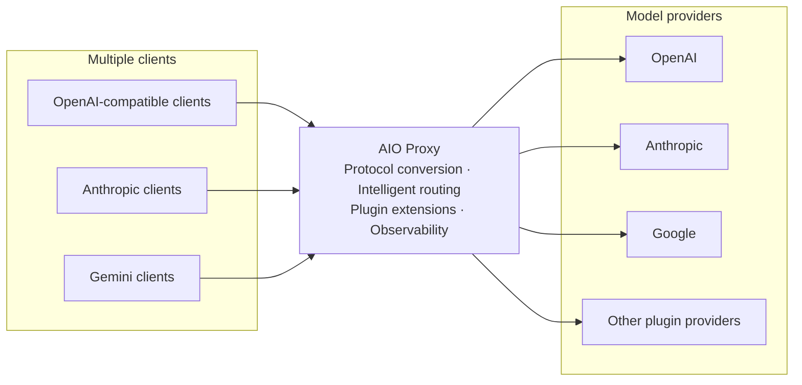

# AIO Proxy

English | [简体中文](https://github.com/aio-proxy/aio-proxy/blob/main/READNE.zh-Hans.md)

Connect and manage multiple model providers through one API endpoint. AIO Proxy provides an extensible plugin system, automatic routing and failover, and observability across usage, cost, and end-to-end request traces.



## Key features

- **Plugin-based integrations**: Connect different model providers through plugins, including AI SDK Provider packages and OAuth accounts.
- **Rich observability**: Track requests, token usage, cost, and complete request traces in one place.
- **Major protocol support**: Accept OpenAI Chat Completions, OpenAI Responses, Anthropic Messages, and Gemini GenerateContent requests.
- **Multi-Provider routing**: Select candidates by model and Provider weight, with model aliases, failover, and session affinity.
- **Transparent protocol conversion**: Use raw passthrough for matching protocols and automatic conversion for cross-protocol requests.

## Install

### Homebrew

```bash
brew install aio-proxy/tap/aio-proxy
```

### Bun

```bash
bun add -g aio-proxy
```

## Quick start

```bash
aio-proxy run --open
```

- API: `http://127.0.0.1:9317`
- Dashboard: `http://127.0.0.1:9317/dashboard`

The first run creates `~/.aio-proxy/config.jsonc`. The initial configuration has no Providers; add one through the Dashboard or edit the configuration file directly:

```bash
aio-proxy config path
aio-proxy config edit
```

## Configuration

The following example routes `gpt-5` to the OpenAI Responses API:

```jsonc
{
  "$schema": "https://cdn.jsdelivr.net/npm/aio-proxy@latest/config.schema.json",
  "providers": {
    "openai": {
      "kind": "api",
      "protocol": "openai-response",
      "baseURL": "https://api.openai.com/v1",
      "apiKey": "{{env.OPENAI_API_KEY}}",
      "models": ["gpt-5"],
    },
  },
}
```

Validate or reload the configuration:

```bash
aio-proxy config validate
aio-proxy reload
```

Editors that support `$schema` can provide completion and validation. Use `{{env.NAME}}` to read environment variables.

### Model metadata and pricing

Each `api` or `ai-sdk` Provider may declare `metadata`, keyed by **upstream model id**, to override client-facing metadata and cost accounting for that Provider's models. User-supplied values take precedence over auto-discovered [models.dev](https://models.dev) data, which in turn wins over built-in defaults. Unknown fields are preserved and warned about rather than rejected, while invalid values (for example a negative price or a non-positive context limit) fail validation with a clear error.

```jsonc
{
  "$schema": "https://cdn.jsdelivr.net/npm/aio-proxy@latest/config.schema.json",
  // When several Providers expose the same public model, reconcile its context window:
  // "min" (default, safe) reports the smallest; "max" reports the largest.
  "router": { "modelContextAggregation": "min" },
  "providers": {
    "openai": {
      "kind": "api",
      "protocol": "openai-response",
      "baseURL": "https://api.openai.com/v1",
      "apiKey": "{{env.OPENAI_API_KEY}}",
      "models": ["gpt-5"],
      "metadata": {
        // Keyed by the upstream model id the Provider serves.
        "gpt-5": {
          "name": "GPT-5", // client-facing display name
          "description": "Frontier model",
          "limit": {
            "context": 1000000, // context window exposed to clients (e.g. Codex `/models`)
            "input": 1000000,
            "output": 128000,
          },
          "capabilities": {
            "reasoning": true,
            "toolCall": true,
            "attachment": true,
          },
          "cost": {
            // Per-token prices are USD per 1,000,000 tokens.
            "input": 1.25,
            "output": 10,
            "cacheRead": 0.125,
            // Per-event fees are USD per event.
            "image": 0.01,
            "webSearch": 0.01,
            "request": 0,
            // Long-context surcharge: the highest crossed tier applies to the whole request.
            "tiers": [{ "tier": { "type": "context", "size": 200000 }, "input": 2.5, "output": 15 }],
          },
        },
      },
    },
  },
}
```

When a request is billed, the Provider that actually served it supplies the price: a configured `cost` wins over the models.dev catalog, and the recorded usage row notes whether the price came from `config`, `models-dev`, or a built-in default (`priceSource`).

## Routing rules

Each key in the `providers` object is a stable **Provider ID**. A request is handled as follows:

1. Find every Provider that exposes the requested model or a matching alias.
2. Try candidates by descending Provider weight; equal or missing Provider weights preserve configuration order.
3. Prefer the Provider previously used by an active session to maintain session continuity.
4. Use raw passthrough for a same-protocol `api` Provider; use AI SDK conversion for other supported combinations.
5. Try the next candidate after a Provider failure; return the final failure if every candidate fails.

## API

| Protocol or purpose      | Method and path                                     |
| ------------------------ | --------------------------------------------------- |
| Health check             | `GET /health`                                       |
| Model list               | `GET /v1/models`                                    |
| OpenAI Chat Completions  | `POST /v1/chat/completions`                         |
| OpenAI Responses         | `POST /v1/responses`                                |
| Anthropic Messages       | `POST /v1/messages`                                 |
| Anthropic Token Counting | `POST /v1/messages/count_tokens`                    |
| Gemini                   | `POST /v1beta/models/{model}:generateContent`       |
| Gemini streaming         | `POST /v1beta/models/{model}:streamGenerateContent` |
| Gemini Token Counting    | `POST /v1beta/models/{model}:countTokens`           |

Call the OpenAI Responses endpoint:

```bash
curl http://127.0.0.1:9317/v1/responses \
  -H 'Content-Type: application/json' \
  -d '{"model":"gpt-5","input":"Introduce AIO Proxy in one sentence."}'
```

## Dashboard and observability

The Dashboard is available at `http://127.0.0.1:9317/dashboard`. Use it to manage Providers and inspect runtime behavior:

- Add, edit, and test Providers, including plugin OAuth login.
- View request volume, token usage, and cost trends.
- Search complete request traces and inspect the status and latency of each Provider attempt.

Set `server.password` to protect the Dashboard. This password does not protect the model API endpoints.

## Network and security

Set the top-level `proxy` to configure a default HTTP(S) proxy. A Provider can inherit it, override it, or disable it with `false`. An `api` Provider can also set upstream request headers through `headers`.

The AIO Proxy process currently binds only to `127.0.0.1`, `::1`, or `localhost`, but it can run on a personal computer, remote server, or in a container. For remote access, expose the service through a reverse proxy, tunnel, or gateway, and configure TLS, authentication, and access control at the outer layer.

## Common commands

```bash
aio-proxy status --deep
aio-proxy provider list --probe
aio-proxy doctor
aio-proxy --help
```

## Contributing

See the [contribution guide](https://github.com/aio-proxy/aio-proxy/blob/main/CONTRIBUTING.md) for development setup and submission guidelines.

## License

[MIT](https://github.com/aio-proxy/aio-proxy/blob/main/LICENSE)
