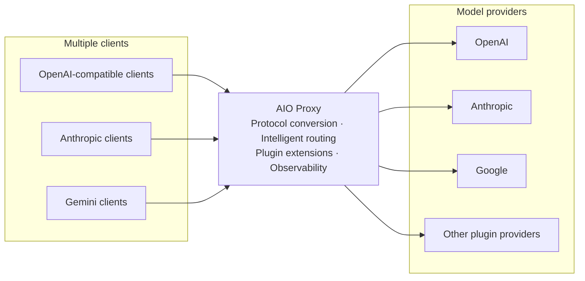

# AIO Proxy

English | [简体中文](https://github.com/aio-proxy/aio-proxy/blob/main/README.zh-Hans.md)

Connect and manage multiple model providers through one API endpoint. AIO Proxy provides an extensible plugin system, automatic routing and failover, and observability across usage, cost, and end-to-end request traces.



## Key features

- **Plugin-based integrations**: Connect different model providers through plugins, including AI SDK Provider packages and OAuth accounts.
- **Rich observability**: Track requests, token usage, cost, and complete request traces in one place.
- **Major protocol support**: Accept OpenAI Chat Completions, OpenAI Responses, Anthropic Messages, and Gemini GenerateContent requests.
- **Multi-Provider routing**: Select candidates by model and Provider weight, with model aliases, failover, and session affinity.
- **Transparent protocol conversion**: Use raw passthrough for matching protocols and automatic conversion for cross-protocol requests.

## Install

### Homebrew

```bash
brew install aio-proxy/tap/aio-proxy
```

### Bun

```bash
bun add -g aio-proxy
```

## Quick start

```bash
aio-proxy run --open
```

- API: `http://127.0.0.1:9317`
- Dashboard: `http://127.0.0.1:9317/dashboard`

The first run creates `~/.aio-proxy/config.jsonc`. The initial configuration has no Providers; add one through the Dashboard or edit the configuration file directly:

```bash
aio-proxy config path
aio-proxy config edit
```

## Configuration

The following example routes `gpt-5` to the OpenAI Responses API:

```jsonc
{
  "$schema": "https://cdn.jsdelivr.net/npm/aio-proxy@latest/config.schema.json",
  "providers": {
    "openai": {
      "kind": "api",
      "protocol": "openai-response",
      "baseURL": "https://api.openai.com/v1",
      "apiKey": "{{env.OPENAI_API_KEY}}",
      "models": ["gpt-5"],
    },
  },
}
```

Validate or reload the configuration:

```bash
aio-proxy config validate
aio-proxy reload
```

Editors that support `$schema` can provide completion and validation. Use `{{env.NAME}}` to read environment variables.

### Multi-protocol endpoints

Some upstreams natively serve more than one protocol. Declare the extra endpoints with `endpoints`; a request whose inbound protocol matches any declared endpoint is forwarded verbatim (raw passthrough) instead of being converted:

```jsonc
{
  "providers": {
    // First-party channel: per-protocol endpoints. Keep the legacy pair as the
    // primary endpoint and append the extra protocols.
    "moonshot": {
      "kind": "api",
      "protocol": "openai-compatible",
      "baseURL": "https://api.moonshot.cn/v1",
      "apiKey": "{{env.MOONSHOT_API_KEY}}",
      "models": ["kimi-k2"],
      "endpoints": [{ "protocol": "anthropic", "baseURL": "https://api.moonshot.cn/anthropic/v1", "auth": "bearer" }],
    },
    // Aggregator gateway: one AI SDK-style base URL shared by several protocols.
    "gateway": {
      "kind": "api",
      "apiKey": "{{env.GATEWAY_KEY}}",
      "models": ["gpt-5"],
      "endpoints": { "baseURL": "https://gw.example.com/v1", "protocol": ["openai-response", "anthropic"] },
    },
  },
}
```

Rules:

- An `endpoints` entry's `baseURL` is exactly what you would pass to the matching AI SDK package: OpenAI-style and Anthropic endpoints include the `/v1` segment, Gemini endpoints include `/v1beta` (so Gemini cannot share a `/v1` base URL — give it its own array entry).
- Vendor docs often quote the Anthropic base for `ANTHROPIC_BASE_URL` (for example `https://api.z.ai/api/anthropic`); append `/v1` when copying it here.
- `auth` is only supported on `anthropic` endpoints (declaring it on an endpoint of any other protocol fails validation): `bearer` sends `Authorization: Bearer` and requires the provider to declare `apiKey`, the default `x-api-key` keeps today's header.
- The top-level `protocol`/`baseURL` pair stays the primary endpoint and keeps its historical passthrough behavior — on passthrough its base URL's path is discarded and only the origin is used, joined with the inbound request path, so a single-protocol provider is best left on the top-level pair; cross-protocol conversion always targets the primary endpoint. Without a top-level pair, the primary endpoint is the first `endpoints` entry (in the shared form, the first protocol in its `protocol` list).
- Editing a provider that declares `endpoints` from the Dashboard currently drops the field; edit the config file directly until Dashboard support lands.

### Model metadata and pricing

Each `api`, `ai-sdk`, or `oauth` Provider may declare `metadata`, keyed by **upstream model id**, to override client-facing metadata and cost accounting for that Provider's models. Metadata is resolved per field in this order: metadata config (including `extend`) > protocol/provider catalog > [models.dev](https://models.dev) > protocol default. Aliases only auto-discover catalog fallback by their public slug. Unknown fields are preserved and warned about rather than rejected, while invalid values (for example a negative price or a non-positive context limit) fail validation with a clear error.

```jsonc
{
  "$schema": "https://cdn.jsdelivr.net/npm/aio-proxy@latest/config.schema.json",
  // When several Providers expose the same public model, reconcile its context window:
  // "min" (default, safe) reports the smallest; "max" reports the largest.
  "router": { "modelContextAggregation": "min" },
  "providers": {
    "openai": {
      "kind": "api",
      "protocol": "openai-response",
      "baseURL": "https://api.openai.com/v1",
      "apiKey": "{{env.OPENAI_API_KEY}}",
      "models": ["gpt-5"],
      "metadata": {
        // Keyed by the upstream model id the Provider serves.
        "gpt-5": {
          "name": "GPT-5", // client-facing display name
          "description": "Frontier model",
          "limit": {
            "context": 400000,
            "input": 272000,
            "output": 128000,
          },
          "capabilities": {
            "reasoning": true,
            "toolCall": true,
            "attachment": true,
          },
          "cost": {
            // Per-token prices are USD per 1,000,000 tokens.
            "input": 1.25,
            "output": 10,
            "cacheRead": 0.125,
            // Audio token prices, USD per 1,000,000 tokens (OpenAI-compatible upstreams only).
            "inputAudio": 2.5,
            "outputAudio": 20,
            // Per-event fees are USD per event.
            "image": 0.01,
            "webSearch": 0.01,
            "request": 0,
            // Long-context surcharge: the highest crossed tier applies to the whole request.
            "tiers": [{ "tier": { "type": "context", "size": 200000 }, "input": 2.5, "output": 15 }],
          },
        },
      },
    },
  },
}
```

`limit.context` is the maximum total context, `limit.input` is the maximum input tokens, and `limit.output` is the maximum output tokens. Configured `input` and `output` cannot exceed configured `context`. For Codex, these distinct limits project to `context_window = input ?? context` and `max_context_window = context ?? input`; `output` is never used as a Codex context window.

When a request is billed, the Provider that actually served it supplies the price: a configured `cost` wins over the models.dev catalog, and the recorded usage row notes whether the price came from `config`, `models-dev`, or a built-in default (`priceSource`).

Per-event fees and audio-token costs are metered from the actual response: generated images and web-search invocations are counted from the served output, and audio tokens are read from the upstream usage (available on OpenAI-compatible Chat Completions upstreams). A fee applies only when the corresponding events occur.

#### Inheriting a catalog entry with `extend`

When your Provider's upstream model id doesn't line up with a [models.dev](https://models.dev) slug (an aliased or renamed model), point `extend` at the slug to inherit as a base layer:

```jsonc
{
  "metadata": {
    // Your Provider serves this under a name models.dev doesn't know.
    "my-frontier-alias": {
      "extend": "openai/gpt-5.5", // inherit this catalog entry as the base
      "name": "My Frontier Model", // override the inherited name
      "cost": { "input": 2 }, // override input price; inherited output/tiers remain
    },
  },
}
```

- `extend` names a models.dev slug (`provider/model`) whose catalog entry supplies the base metadata (name, limit, capabilities, cost).
- Your explicit fields override the inherited ones. Merging is deep for objects (e.g. `cost.input` above overrides only that field while `cost.output` is inherited), and arrays (such as `capabilities.reasoningOptions`, `modalities`, and cost `tiers`) replace the inherited array wholesale rather than merging by index.
- Only the `extend` target is used as the base — the model's own upstream id is **not** auto-matched against the catalog. That is the whole point of `extend`: the name doesn't line up.
- Inherited `cost` is treated as a config price: you opted in through `extend`, so billing tags it `priceSource: "config"`, just like a `cost` you wrote out in full.
- If the target slug isn't found in the catalog, your explicit fields are kept (the `extend` key is dropped) and a warning is logged; startup is never blocked.

## Routing rules

Each key in the `providers` object is a stable **Provider ID**. A request is handled as follows:

1. Find every Provider that exposes the requested model or a matching alias.
2. Try candidates by descending Provider weight; equal or missing Provider weights preserve configuration order.
3. Prefer the Provider previously used by an active session to maintain session continuity.
4. Use raw passthrough for a same-protocol `api` Provider; use AI SDK conversion for other supported combinations.
5. Try the next candidate after a Provider failure; return the final failure if every candidate fails.

## API

| Protocol or purpose      | Method and path                                     |
| ------------------------ | --------------------------------------------------- |
| Health check             | `GET /health`                                       |
| Model list               | `GET /v1/models`                                    |
| OpenAI Chat Completions  | `POST /v1/chat/completions`                         |
| OpenAI Responses         | `POST /v1/responses`                                |
| Anthropic Messages       | `POST /v1/messages`                                 |
| Anthropic Token Counting | `POST /v1/messages/count_tokens`                    |
| Gemini                   | `POST /v1beta/models/{model}:generateContent`       |
| Gemini streaming         | `POST /v1beta/models/{model}:streamGenerateContent` |
| Gemini Token Counting    | `POST /v1beta/models/{model}:countTokens`           |

Call the OpenAI Responses endpoint:

```bash
curl http://127.0.0.1:9317/v1/responses \
  -H 'Content-Type: application/json' \
  -d '{"model":"gpt-5","input":"Introduce AIO Proxy in one sentence."}'
```

## Dashboard and observability

The Dashboard is available at `http://127.0.0.1:9317/dashboard`. Use it to manage Providers and inspect runtime behavior:

- Add, edit, and test Providers, including plugin OAuth login.
- View request volume, token usage, and cost trends.
- Search complete request traces and inspect the status and latency of each Provider attempt.

Set `server.password` to protect the Dashboard. It does not protect model API endpoints; use `server.apiKeys` for those.

## Network and security

Set the top-level `proxy` to configure a default HTTP(S) proxy. A Provider can inherit it, override it, or disable it with `false`. An `api` Provider can also set upstream request headers through `headers`.

By default AIO Proxy binds to `127.0.0.1`. Set `server.host` to another non-empty host (for example, `0.0.0.0`) when clients need remote access. The proxy serves HTTP only, so terminate TLS with a reverse proxy, tunnel, or gateway before exposing it beyond a trusted network. Add `server.apiKeys` before doing so:

```jsonc
{
  "server": {
    "host": "0.0.0.0",
    "apiKeys": [{ "key": "{{env.AIO_PROXY_KEY}}", "label": "CI" }],
    "password": "a-dashboard-password",
  },
}
```

Each `label` is optional and only helps identify a key. With at least one key configured, every `/v1/*` and `/v1beta/*` request (including `/v1/models`) must send `Authorization: Bearer <key>` or `X-API-Key: <key>`; native Gemini clients may use `X-Goog-Api-Key`, `?key=`, or `?auth_token=`. Matched caller credentials are stripped before the request is forwarded upstream. An empty list leaves model APIs open. Remote Dashboard access requires `server.password` and its Dashboard session. `/admin/*` remains loopback-only for local CLI control. Browser writes without a Dashboard password must come from a loopback Origin on the proxy port (`127.0.0.1`, `localhost`, `[::1]`, or the configured loopback host). Direct loopback peers, including a local reverse proxy, are treated as local.

## Agent integrations

Install or update the managed OpenCode, Pi, and oh-my-pi adapters, then sign in with each Agent's native login. Integrations are global to the current user; aio-proxy does not write project-local Agent config.

```bash
aio-proxy agent configure opencode
aio-proxy agent configure pi
aio-proxy agent configure omp
aio-proxy agent list --check
aio-proxy agent list --authorizations
aio-proxy agent remove <target>
```

Supported floors are OpenCode 1.17.10, Pi 0.84.2, and oh-my-pi 17.3.7. After configure, sign in with `opencode auth login --provider aio-proxy` or `/login aio-proxy` in Pi and oh-my-pi. Reload or restart the Agent so it loads the updated adapter. `aio-proxy upgrade` refreshes managed adapters the same way and also requires a reload.

When `server.apiKeys` is enabled, set `server.password` so Device Approval can authorize the Agent. `aio-proxy agent remove` revokes the installation and deletes aio-proxy's managed files; it does not log the Agent out of its own host account. If the local control plane is offline, remove refuses and leaves files in place.

aio-proxy does not copy an upstream API key or a shared embedded SK into an Agent.

## Common commands

```bash
aio-proxy status --deep
aio-proxy provider list --probe
aio-proxy doctor
aio-proxy --help
```

## Contributing

See the [contribution guide](https://github.com/aio-proxy/aio-proxy/blob/main/CONTRIBUTING.md) for development setup and submission guidelines.

## License

[MIT](https://github.com/aio-proxy/aio-proxy/blob/main/LICENSE)
