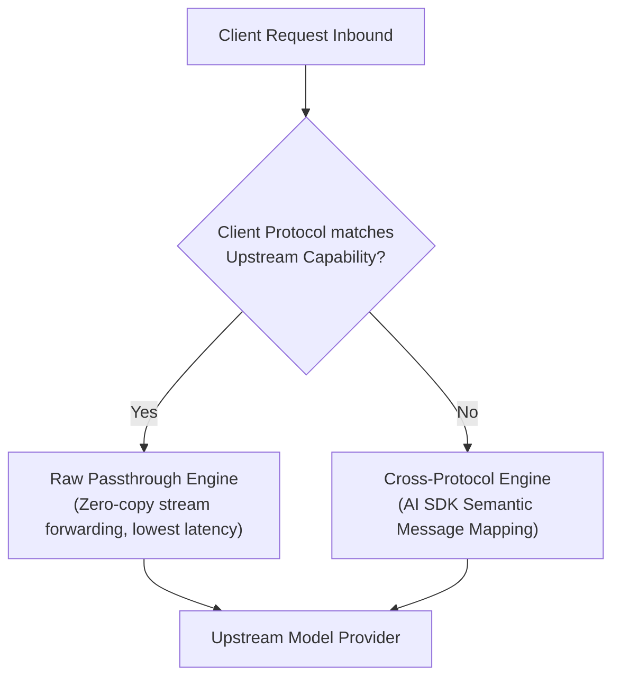

# Protocols & Transparent Passthrough

AIO Proxy supports diverse AI API protocols spanning chat completions, structured responses, vision, voice, embeddings, and agent runtimes.

## Supported Inbound Protocols

| Client Protocol        | Standard Request Path                | Feature Highlights                                                                |
| :--------------------- | :----------------------------------- | :-------------------------------------------------------------------------------- |
| **OpenAI Responses**   | `/v1/responses`                      | Next-gen Responses API, streaming events, multimodal input, native tool lifecycle |
| **OpenAI Compatible**  | `/v1/chat/completions`               | Standard chat completions, function callings, tool calls, streaming SSE           |
| **Anthropic Messages** | `/v1/messages`                       | `system` prompt blocks, prompt caching, tool use, thinking tags                   |
| **Google Gemini**      | `/v1beta/models/*:generateContent`   | Gemini native contents format, multimodal inline data, safety settings            |
| **OpenAI Embeddings**  | `/v1/embeddings`                     | Vector representations supporting batch text inputs                               |
| **OpenAI Realtime**    | `/v1/realtime`, `/v1/realtime/calls` | Low-latency WebRTC and WebSocket bidirectional audio/text streams                 |
| **OpenAI Media**       | `/v1/images/*`, `/v1/audio/*`        | Image generation/edits, speech synthesis, and audio transcriptions                |

---

## Zero-Overhead Passthrough vs. Protocol Transforms

AIO Proxy features a dual-engine architecture:



### 1. Same-Protocol Raw Passthrough

- When a client request matches the upstream provider's native protocol (e.g. Anthropic Client -> Anthropic Provider), AIO Proxy engages **Raw Passthrough Mode**.
- Request bodies and response streams are piped transparently with zero-copy stream processing, introducing negligible latency (<1ms) while preserving vendor-specific headers, beta flags, and custom parameters.

### 2. Cross-Protocol Intelligent Transforms

- When protocols differ (e.g. Claude Code Anthropic Messages -> OpenAI Provider), AIO Proxy converts inbound payloads into universal model messages and invokes upstream via standardized adapter transforms.
- Tools, function calling parameters, thoughts, and stream fragments are accurately translated.

---

## Multi-Protocol Endpoints

Certain providers (such as OpenRouter, aggregator gateways, or multi-modal services) expose multiple protocol endpoints under one Base URL. You can declare `endpoints` to enable matching raw passthrough across different paths:

```jsonc title="config.jsonc"
{
  "providers": {
    "custom-gateway": {
      "kind": "api",
      "apiKey": "{{env.GATEWAY_KEY}}",
      "models": ["gpt-5", "claude-sonnet-4-6"],
      "endpoints": [
        // Serves OpenAI Compatible requests
        {
          "baseURL": "https://api.gateway.example/v1",
          "protocol": "openai-compatible",
        },
        // Serves Anthropic Messages requests natively
        {
          "baseURL": "https://api.gateway.example/v1",
          "protocol": "anthropic",
          "auth": "bearer",
        },
      ],
    },
  },
}
```

With this configuration:

- Inbound `/v1/chat/completions` requests will passthrough to the OpenAI-compatible endpoint.
- Inbound `/v1/messages` requests will passthrough directly to the Anthropic endpoint.
