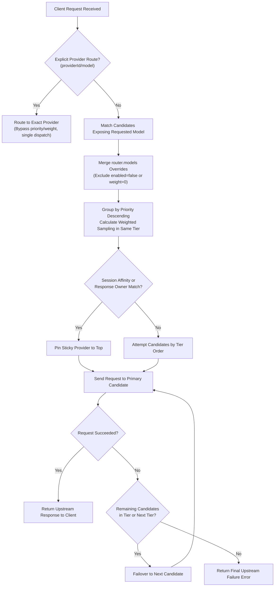

# Routing & Failover

AIO Proxy adopts a "Model-First" intelligent routing strategy. When a client issues a request, AIO Proxy dynamically selects, dispatches, and falls back among candidate providers based on the requested model name and session traits.

## Core Concepts

- **Provider ID**: The key name within the `providers` object in your configuration; serves as the globally unique, stable identity of that provider.
- **Provider Priority**: An integer failover tier (`0..10000`, default `0`). **Higher numbers are attempted first**. Lower-priority providers are only tried if higher-priority providers fail.
- **Provider Weight**: A relative integer value for distributing traffic within the same priority tier (default `1`, rounded and clamped to `0..10000`). **Higher numbers receive proportionally more traffic**. A weight of `0` excludes the provider from normal model routing.

## Routing Decision Flow

The complete decision pipeline for an incoming model request is illustrated below:



---

## 1. Explicit Provider Targeting (`providerId/model`)

Clients can bypass dynamic routing and route directly to a designated provider by prefixing the model with the Provider ID:

```json
{
  "model": "deepseek-direct/deepseek-chat",
  "messages": [{ "role": "user", "content": "Hello" }]
}
```

- When the model string contains a `/`, AIO Proxy parses the prefix as the Provider ID.
- Matches against configured `providers` keys.
- **Bypasses priority and weight calculations**, delivering directly to the specified upstream.
- If that provider is offline or fails, no failover occurs, returning the exact upstream error immediately.

---

## 2. Normal Model Matching & Overrides

When an ordinary model name (e.g. `gpt-5`) is requested:

1. **Candidate Discovery**: Finds all providers whose `models` array contains `gpt-5` or an alias mapping to it.
2. **Global Overrides (`router.models`)**: Merges fine-grained overrides defined under `router.models`:
   ```jsonc title="config.jsonc"
   {
     "router": {
       "models": {
         "gpt-5": {
           "providers": {
             "openai-official": { "priority": 100, "weight": 2 },
             "azure-backup": { "priority": 50, "weight": 1 },
             "experimental-provider": { "enabled": false },
           },
         },
       },
     },
   }
   ```
3. Providers marked with `"enabled": false` or effective `"weight": 0` are excluded from the candidate pool.

---

## 3. Tiered Priority & Weighted Sampling

Candidates are sorted primarily by **Priority descending**:

- **Tier 1 (Priority 100)**: Tried first. If multiple providers have priority 100, traffic is distributed proportionally according to their `weight` ratio.
- **Tier 2 (Priority 50)**: Used as cold backup. Receives traffic only when all Tier 1 candidates fail.

Deterministic or randomized draws depend on session characteristics:

- Requests carrying stable session identifiers execute deterministic hashing.
- Stateless requests execute weighted random draws.

---

## 4. Session Continuity (Session Affinity)

For multi-turn chats or agent workflows, switching upstreams mid-session can cause context loss or cache invalidation. AIO Proxy provides native session pinning:

1. **Header Identification**: Reads `X-Session-ID`, `X-Thread-ID`, or OpenAI `conversation_id`.
2. **Provider Pinning**: The provider that first succeeds in a session is pinned as the preferred upstream for subsequent requests in that session.
3. **Graceful Failover**: If the pinned provider experiences an outage, AIO Proxy seamlessly falls back to the next available tier candidate without dropping the connection.

---

## 5. Failover Mechanism

When an upstream attempt returns a retryable error (HTTP 5xx, network timeout, rate limit exceeded):

1. The error details and latency are recorded in trace diagnostics.
2. The pipeline advances to the next candidate in the queue.
3. Only when all candidates in all tiers fail will AIO Proxy return the final failure response to the client.
