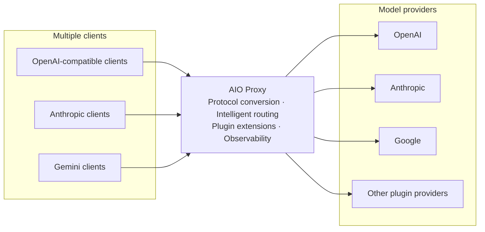

# How AIO Proxy Works

AIO Proxy provides one local endpoint between clients and model providers. Clients keep using familiar OpenAI, Anthropic, or Gemini APIs; AIO Proxy selects a provider from the requested model, handles protocol conversion and failover, and records each request.

## How a request is handled

1. A client sends a request to AIO Proxy and specifies a model name.
2. AIO Proxy finds every Provider that exposes that model name or a matching model alias.
3. Candidates are tried by descending Provider weight; ties keep configuration order. A Provider bound to an active session is preferred to preserve session continuity.
4. When the client and upstream use the same protocol, the request is passed through unchanged. Other supported combinations are converted before being sent upstream.
5. When a Provider fails, AIO Proxy tries the next candidate. If every candidate fails, it returns the last failure.

## Model names determine routing

Each key in the configuration is a stable **Provider ID**. A Provider can expose one or more model names, and multiple Providers can expose the same model name.

For example, when a client requests `gpt-5`, AIO Proxy selects from every Provider exposing `gpt-5` or its alias. Assigning different Provider weights sets the preferred order and enables automatic failover when the preferred upstream is unavailable.

Clients do not need to know which upstream ultimately serves a request. Point the existing client's Base URL at AIO Proxy and keep using the same model name.

## Inspect results in the Dashboard

The Dashboard records each request and every Provider attempt. It shows the selected Provider, request status, latency, token usage, and cost; open the full request trace when you need to investigate a problem.
