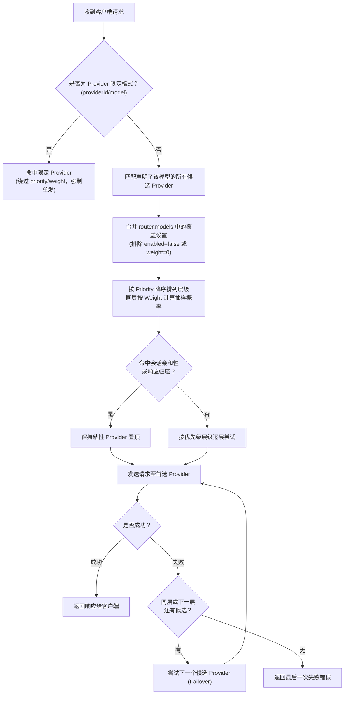

# 路由与故障回退

AIO Proxy 采用“模型优先 (Model-First)”的智能路由策略。客户端发送请求时，AIO Proxy 会根据请求的模型名称与会话特征，在候选提供商之间进行智能分流与故障切换。

## 核心概念

- **提供商 ID (Provider ID)**：在配置的 `providers` 对象中的键名，是该提供商在系统内的全局唯一稳定标识。
- **提供商优先级 (Provider Priority)**：整数故障切换层级（`0..10000`，默认为 `0`）。**数值越大越先被尝试**。高优先级的提供商失败后，才会回退尝试低优先级的提供商。
- **提供商权重 (Provider Weight)**：同一优先级层级内分配流量的相对数值（默认为 `1`，经四舍五入后钳制在 `0..10000`）。**数值越大概率分得越多流量**。权重为 `0` 会禁用普通候选路由。

## 路由调度流程

一次模型请求的完整决策链路如下：



### 1. 精确 Provider 限定路由

如果客户端请求的模型字符串以 `提供商ID/模型名` 格式提供（例如 `openai-chatgpt/gpt-5` 或 `moonshot/kimi-k2`）：

- AIO Proxy 会直接路由到指定的提供商。
- 此时将**绕过**全局的 Priority 与 Weight（即使其配置的有效 Weight 为 0 依然会尝试）。
- 但如果该 Provider 显式被设为 `enabled: false`，请求依然会被拦截。

### 2. 普通模型名匹配与覆盖合并

若请求为普通模型名（如 `gpt-5`）：

1. AIO Proxy 扫描所有声明了该模型（或该别名目标）的可用提供商。
2. 合并 `router.models.<model-name>.providers.<provider-id>` 中针对该特定模型的覆盖参数（可按模型单独覆写 `priority`、`weight`、`cost` 或 `limit`）。
3. 过滤掉被禁用的候选。

### 3. 分层与加权抽样

候选者首先按 `priority` 降序划分成若干梯队：

- 只有最高优先级梯队的候选提供商全部尝试失败后，才会进入下一个优先级梯队。
- 在同一个优先级梯队内，按各候选者的有效 `weight` 计算流量百分比。

**示例配置：**

```yaml
providers:
  provider-a:
    priority: 0
    weight: 1000
router:
  models:
    model-m:
      providers:
        provider-a: { priority: 30, weight: 6000 }
        provider-b: { priority: 30, weight: 4000 }
        provider-c: { priority: 20 }
```

在上面的策略中：

- `provider-a` 与 `provider-b` 处于同等优先级（`priority: 30`）。
- 每当有请求进入时，约 60% 的概率先尝试 `provider-a`，约 40% 先尝试 `provider-b`。
- 假设首选的 `provider-a` 请求超时或返回 429/5xx 错误，AIO Proxy 会立即自动故障切换到同一梯队的 `provider-b`。
- 仅当 `provider-a` 和 `provider-b` 均不可用时，才会降级尝试 `priority: 20` 的 `provider-c`。

### 4. 会话亲和性 (Session Affinity)

在诸如多轮对话、Prompt Cache 命中敏感的场景中，频繁在多个提供商之间轮询会导致缓存命中率剧烈下降。

AIO Proxy 会识别请求的逻辑会话（例如 OpenAI `session_id`、Anthropic 特征、相关 Header 或生成的会话上下文）：

- 已成功处理过该会话的 Provider 会被赋予亲和性，并在同梯队甚至跨梯队优先被置顶。
- 稳定（非 generated）逻辑会话采用确定性抽取，保证在路由拓扑未改变时，Token 预估计算与实际生成使用完全相同的 Provider 尝试顺序。

### 5. 故障回退 (Failover)

当某个提供商因网络异常、5xx 错误、认证失效或 429 配额耗尽报错时：

- AIO Proxy 会捕获该失败，记录在链路跟踪日志中，并无缝切到下一个候选提供商。
- 仅在**所有可用候选均告失败**时，AIO Proxy 才会向客户端返回最后一次尝试所捕获的错误。
