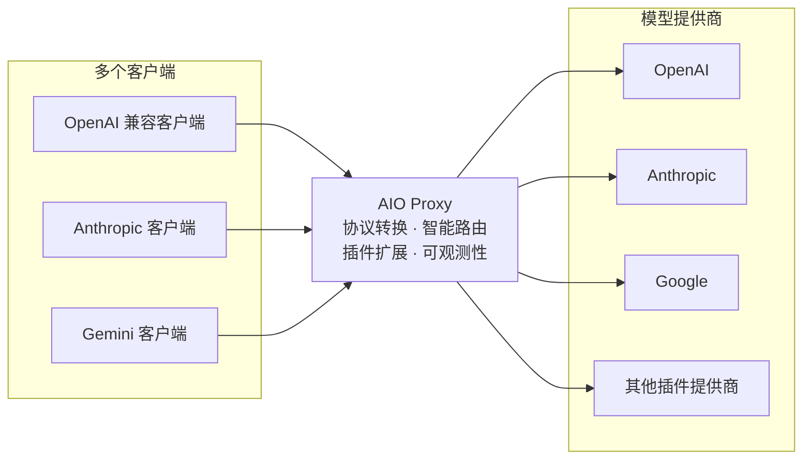

# AIO Proxy 如何工作

AIO Proxy 在客户端与模型提供商之间提供一个统一的本地端点。客户端继续使用熟悉的 OpenAI、Anthropic 或 Gemini API；AIO Proxy 根据请求中的模型名选择合适的提供商，并负责协议转换、故障切换和请求记录。

## 一条请求如何被处理

1. 客户端向 AIO Proxy 发送请求，并指定模型名。
2. AIO Proxy 查找所有公开该模型名或对应模型别名的提供商。
3. 候选提供商按提供商权重从高到低尝试；权重相同时，保持配置中的顺序。已绑定到会话的提供商会优先，以维持会话连续性。
4. 客户端协议与上游协议一致时，请求会原样转发；其他受支持的组合会转换后再发送给上游。
5. 某个提供商失败时，AIO Proxy 会继续尝试下一个候选提供商；全部失败后返回最后一次失败结果。

## 模型名决定路由

配置中的每个键都是稳定的**提供商 ID**。一个提供商可公开一个或多个模型名；多个提供商也可以公开同一个模型名。

例如，客户端请求 `gpt-5` 时，AIO Proxy 会从所有声明了 `gpt-5`（或其别名）的提供商中选择候选项。为这些提供商设置不同的提供商权重，就能决定优先顺序，并在首选上游不可用时自动切换。

客户端不需要知道实际使用的是哪个上游，只需把原有客户端的 Base URL 指向 AIO Proxy，并保持原来的模型名。

## 在 Dashboard 中查看结果

Dashboard 会记录每一次请求以及每个提供商的尝试。你可以查看最终使用的提供商、请求状态、耗时、令牌用量和费用；需要排查问题时，还可以打开完整请求链路。
